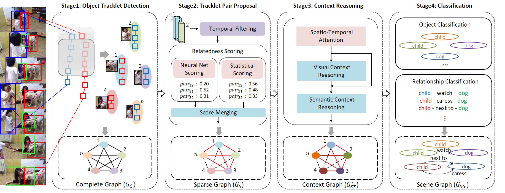
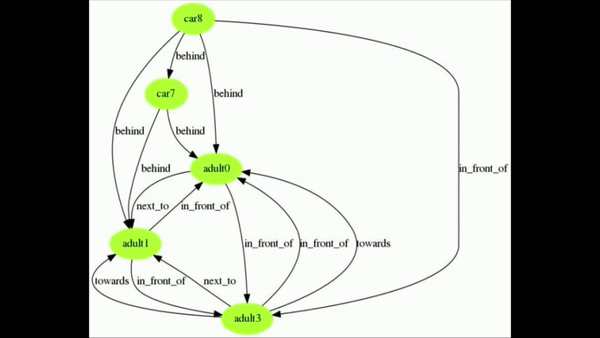

# VSGG-Net

MDPI Sensors Special Issue Applications of Video Processing and Computer Vision Sensor

[Tracklet Pair Proposal and Context Reasoning for Video Scene Graph Generation](https://www.mdpi.com/1424-8220/21/9/3164)

- - -

## Model

## keywords
- Video Scene Graph
- Visual Relationship Detection
- Tracklet Pair Proposal
- Spatio-Temporal Context Reasoning
- Graph Neural Network

- - -

## Video Demo
* Input Video
  * 
* Scene Graph
  *  
